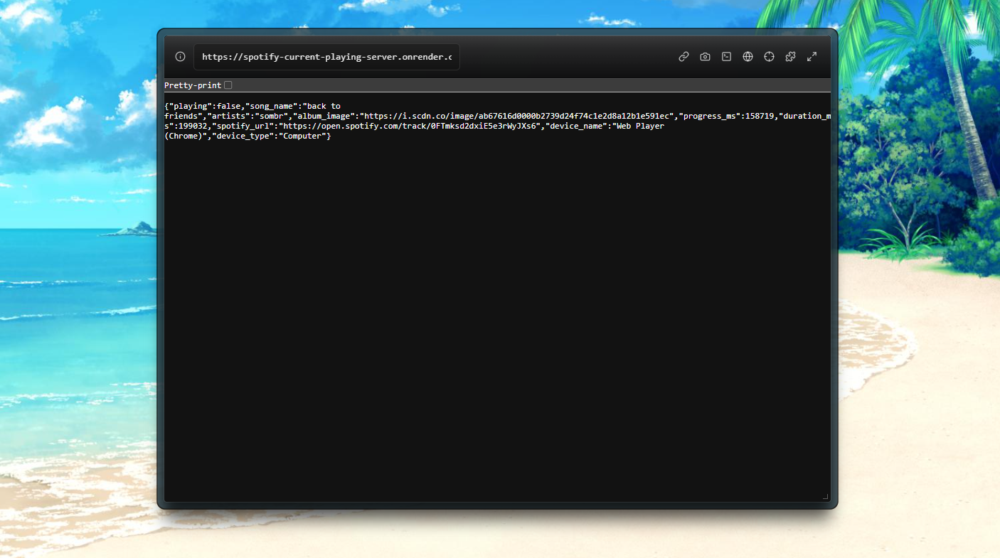

# Spotify Server for `Current Playback State`

A Node.js Express server that fetches your currently playing track from Spotify using the Web API and returns clean, formatted data.



## Features

* Get currently playing track information
* Clean JSON response with essential data
* Automatic token refresh handling
* Device information included
* Progress tracking support

## Prerequisites

* Node.js (v14 or higher)
* Spotify Account

## 🚀 Quick Start

### 1. Install Dependencies

```bash
npm init -y
npm install express dotenv node-fetch
```

### 2. Create Spotify App

1. Go to [Spotify Developer Dashboard](https://developer.spotify.com/dashboard)
2. Click "Create App"
3. Fill in app details:
   * **App Name** : Your choice
   * **App Description** : Your choice
   * **Redirect URI** : `https://appurl.com/callback (localhost is not supported due security concerns)`
4. Save your `Client ID` and `Client Secret`

### 3. Environment Setup

Create a `.env` file in your project root:

```env
SPOTIFY_CLIENT_ID=your_client_id_here
SPOTIFY_CLIENT_SECRET=your_client_secret_here
```

### 4. Get Your Refresh Token

#### Step 4a: Authorization URL

Replace `<your_client_id>` with your actual Client ID and the url and visit this URL in your browser:

```
https://accounts.spotify.com/authorize?client_id=<your_client_id>&response_type=code&redirect_uri=https%3A%2F%2Fappurl.com%2Fcallback&scope=user-read-currently-playing%20user-read-playback-state
```

#### Step 4b: Get Authorization Code

After authorizing, you'll be redirected to:

```
https://appurl.com/callback?code=XXXXXXXXXX
```

Copy the `code` parameter value from the URL

#### Step 4c: Exchange Code for Refresh Token

1. Create `refreshToken.js`: Refer the repository

2. Run the script:

```bash
node refreshToken.js
```

You will get something like:

`{   "access_token": "BQCS...",   "token_type": "Bearer",   "expires_in": 3600,   "refresh_token": "AQCS..." }`

Copy the `refresh_token` value to your `.env` file as `SPOTIFY_REFRESH_TOKEN=your_refresh_token_here`

## 🖥️ Server Implementation

Create `server.js`: Refer the repository

## 🏃‍♂️ Running the Server

```bash
node server.js
```

Visit `http://localhost:3000/np` to see your current playback state.

## 📊 API Response

### When Music is Playing

```json
{"playing":true,"song_name":"Buona sera ciao ciao","artists":"Italian Disco Mafia","album_image":"https://i.scdn.co/image/ab67616d0000b273ef3338fc23f2e22c71306c9f","progress_ms":150185,"duration_ms":254599,"spotify_url":"https://open.spotify.com/track/5pTh13K4WRIjOrmOxbmBXP","device_name":"Web Player (Chrome)","device_type":"Computer"}
```

### When Nothing is Playing

```json
{"error":"invalid json response body at https://api.spotify.com/v1/me/player reason: Unexpected end of JSON input"}
```

## Testing

Run the script  `test-token.js` using `node test-token.js` to check whether the credentials are working or not.

If the credentials are correct, you will get such a response:

```json
Status: 200
Response: {
  access_token: 'xxxxxxxxxxxxxxxxxxxxxxxxx',
  token_type: 'Bearer',
  expires_in: xxxx,
  scope: 'user-read-playback-state user-read-currently-playing user-read-recently-played'
}
✅ Token is valid!
```

## 🔧 Configuration

### Required Scopes

The following Spotify scopes are required:

* `user-read-currently-playing`
* `user-read-playback-state`

### Environment Variables

| Variable                  | Description                              |
| ------------------------- | ---------------------------------------- |
| `SPOTIFY_CLIENT_ID`     | Your Spotify app's Client ID             |
| `SPOTIFY_CLIENT_SECRET` | Your Spotify app's Client Secret         |
| `SPOTIFY_REFRESH_TOKEN` | Long-lived token for API access          |
| `PORT`                  | Server port (optional, defaults to 3000) |

## 🚨 Common Issues

#### "Nothing is playing" Response

* Ensure you have Spotify Premium
* Make sure music is actively playing (not paused)
* Check that your app has the correct scopes

#### Token Refresh Errors

* Verify your Client ID and Client Secret are correct
* Ensure your refresh token was generated with the correct redirect URI
* Check that your Spotify app settings match your configuration

#### 403 Forbidden Errors

* Confirm you have Spotify Premium (required for playbook state API)
* Verify the required scopes are included in your authorization

## Resources

* [Spotify For Developers](https://developer.spotify.com/)
* [Spotify Web API Documentation](https://developer.spotify.com/documentation/web-api/)
* [Spotify Authorization Guide](https://developer.spotify.com/documentation/general/guides/authorization/)
* [Get Current Playback State Endpoint](https://developer.spotify.com/documentation/web-api/reference/get-information-about-the-users-current-playback)
